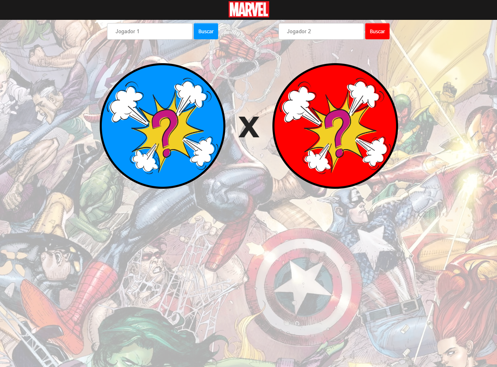
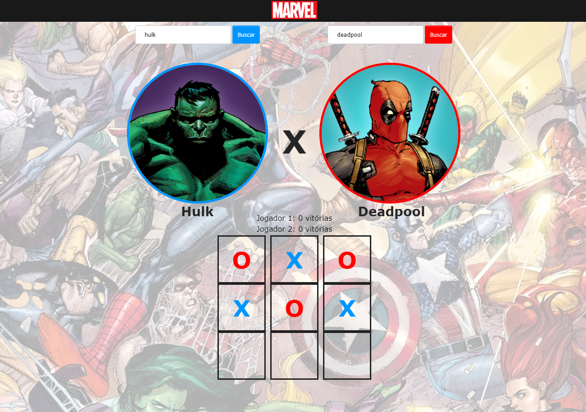

# Descrição da Aplicação - Marvel Jogo da velha
O "Marvel Jogo da Velha" é uma aplicação web desenvolvida utilizando o framework Angular 10.0.5. O objetivo do jogo é oferecer uma experiência divertida e interativa baseada no clássico jogo da velha, onde os jogadores podem escolher seus personagens favoritos do universo Marvel para representá-los no jogo. Os jogadores podem competir entre si, alternando entre os heróis e vilões da Marvel, enquanto tentam formar sequências de três símbolos (X ou O) na vertical, horizontal ou diagonal. O joog está hospedado no link https://marvel-game-hugo.netlify.app/

## Características do App
<b>Seleção de Personagens da Marvel:</b> Os jogadores podem escolher entre uma ampla variedade de personagens do universo Marvel, como Hulk, Homem de Ferro, Capitão América, Thanos, entre outros, para representá-los no tabuleiro.

<b>Jogo da Velha Interativo:</b> O jogo oferece uma experiência clássica do jogo da velha, onde os jogadores alternam entre suas jogadas para tentar vencer o adversário.

<b>Animações e Efeitos Visuais:</b> Animações e efeitos visuais aprimoram a experiência de jogo, incluindo transições suaves entre as jogadas e feedback visual para indicar o vencedor ou um empate.

<b>Pontuações e Estatísticas:</b> O aplicativo mantém o controle das pontuações dos jogadores, registrando o número de vitórias de cada um ao longo do tempo.

## Estrutura do Projeto

O projeto está estruturado com os componentes, services e pastas distribuidos da seguinte maneira:

Marvel-app/
- ├── src/                  # Código-fonte do aplicativo
- │   ├── app/              # Componentes e módulos principais
- │   ├── ├── jogo/         # Componente principal do jogo da velha.
- │   ├── ├── personagem/   # Componente para seleção de personagens.
- │   ├── ├── navbar/       # Componente para a barra de navegação.
- │   ├── ├── services/     # Serviços.
- │   ├── ├── ├── score/    # Serviço para gerenciar os placares do jogo.
- │   ├── ├── ├── character/ #Serviço para obter informações sobre personagens da Marvel.
- │   ├── assets/           # Recursos estáticos (imagens, etc.)
- │   ├── environments/     # Configurações de ambiente
- │   ├── theme/            # Estilos do aplicativo
- │   ├── index.html        # Página HTML principal
- ├── .gitignore            # Arquivos e pastas ignorados pelo Git
- ├── angular.json          # Configurações do Angular CLI
- ├── ionic.config.json     # Configurações do Ionic CLI
- ├── package.json          # Dependências e scripts do projeto
- ├── README.md             # Documentação do projeto

# Instruções de Execução e Instalação do Projeto

## Pré-requisitos
Node.js e npm instalados na máquina local.

Angular CLI instalado globalmente.

## Instalação

Clone o repositório do projeto do GitHub para o seu ambiente local.

No terminal, navegue até o diretório raiz do projeto.

Execute o comando `npm install` para instalar as dependências do projeto.

## Execução

Execute `ng serve` no terminal para iniciar a aplicação em modo de desenvolvimento.

Acesse a aplicação no navegador através do endereço http://localhost:4200/.

# Pacotes Utilizados
- <b>Angular CLI:</b> Ferramenta de linha de comando do Angular para criar, compilar e executar aplicativos Angular.
- <b>CryptoJS:</b> Biblioteca utilizada para criptografia e descriptografia de dados, para acessar os dados da API.
- <b>SweetAlert2:</b> Biblioteca para exibição de caixas de diálogo e alertas personalizados.
- <b>Jasmine:</b> Framework de teste de comportamento para JavaScript, usado para escrever e executar testes unitários em aplicativos Angular.

# Execução de Testes
Foram criados alguns testes de exemplo são eles:

<b>Teste "componente criado":</b> Este teste verifica se o componente foi criado com sucesso. Ele garante que a instância do componente seja criada corretamente durante o processo de teste.

<b>Teste "jogo inicia corretamente":</b> Este teste verifica se o jogo é inicializado corretamente quando o método initializeGame() é chamado. Ele verifica se o tabuleiro é criado como uma matriz de células vazias, se o jogador atual é definido e se o vencedor é nulo no início do jogo.

<b>Teste "jogadores alternados corretamente:"</b> Este teste verifica se os jogadores alternam corretamente após cada movimento. Ele simula o movimento de um jogador e verifica se o próximo jogador é atribuído corretamente.

Execute `npm test` para executar todos os testes disponíveis.

# MarvelApp

This project was generated with [Angular CLI](https://github.com/angular/angular-cli) version 10.0.5.

## Development server

Run `ng serve` for a dev server. Navigate to `http://localhost:4200/`. The app will automatically reload if you change any of the source files.

## Code scaffolding

Run `ng generate component component-name` to generate a new component. You can also use `ng generate directive|pipe|service|class|guard|interface|enum|module`.

## Build

Run `ng build` to build the project. The build artifacts will be stored in the `dist/` directory. Use the `--prod` flag for a production build.

## Running unit tests

Run `ng test` to execute the unit tests via [Karma](https://karma-runner.github.io).

## Running end-to-end tests

Run `ng e2e` to execute the end-to-end tests via [Protractor](http://www.protractortest.org/).

## Further help

To get more help on the Angular CLI use `ng help` or go check out the [Angular CLI README](https://github.com/angular/angular-cli/blob/master/README.md).
